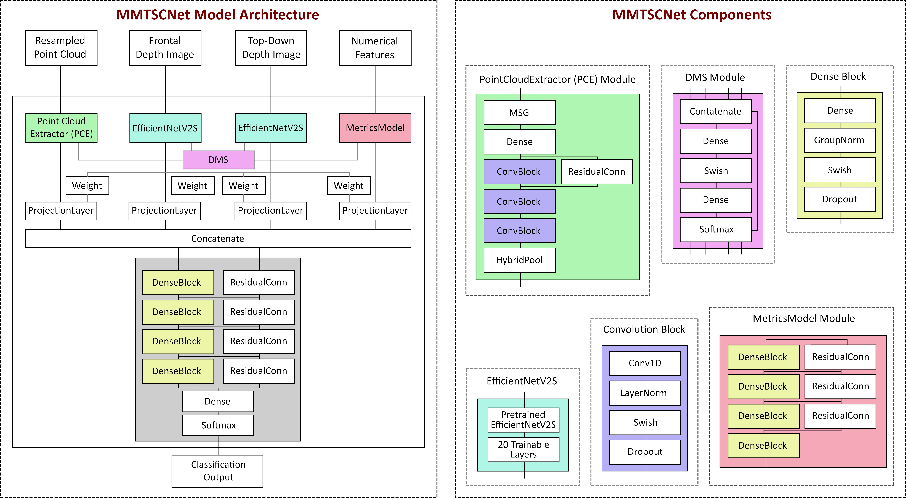
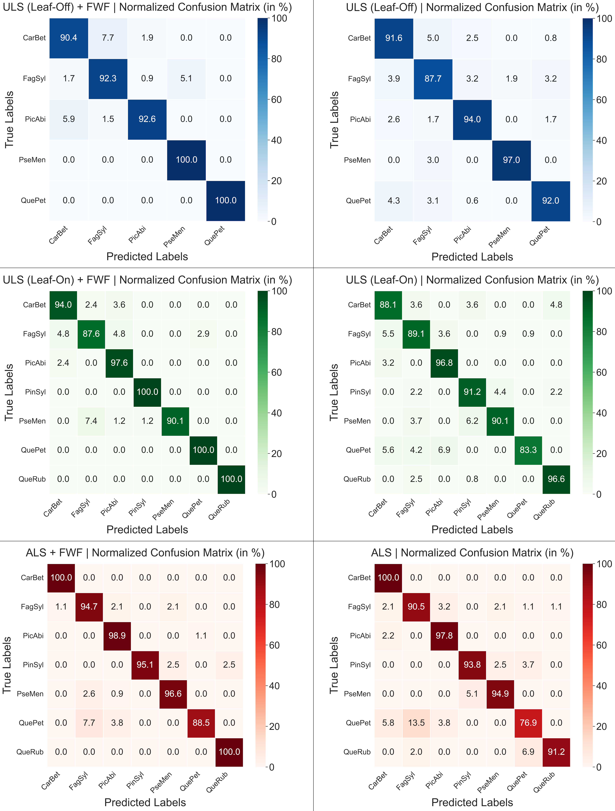

# MMTSCNet
This is the official repository for MMTSCNet (Multimodal Tree Species Classification Network). This network was developed to accurately classify LiDAR point clouds of individual trees by augmenting the existing geometric information from the point cloud with numerical features and bidirectional, color-coded views of the point clouds. This approach ensures as much information as possible is captured and allows for high accuracies when classifying coniferous and broadleaf tree species.

# Datasets and Study Sites
The model was trained and used to predict on the PANGAEA dataset of multi-source segmented LiDAR tree point clouds by Weiser et al. (2022), available at [https://doi.pangaea.de/10.1594/PANGAEA.942856](https://doi.pangaea.de/10.1594/PANGAEA.942856), with pre-segmented tree point clouds from multiple forest plots near Karlsruhe and Bretten in Germany. For each plot, FWF data was available as a byproduct and can be found here: [https://doi.org/10.1594/PANGAEA.947038](https://doi.org/10.1594/PANGAEA.947038).


# Model architecture
The architecture is composed of four branches, each handling a different type of input data, hence the name "Multimodal". The first branch extracts features from ~60 different metrics, generated from geometric properties of the point clouds themselves as well as full-waveform LiDAR data if available. The second and third branch use an instance of EfficientNetV2S to extract features from the frontal and top-down views of the tree point clouds and the fourth branch acts upon the point cloud directly to extract features. The extracted features are then weighed and concatenated using the Dynmic Modality Scaling (DMS) module to create a single feature vector which is fed into the classification head. The resulting feature-rich vector is then classified by a Softmax-Layer.



# Experimental Results
During our experiments with the data provided by Weiser at al. (2022), MMTSCNet was able to score the following exceptionally good results.



# Installation
To train and use MMTSCNet on Windows 11, follow the installation guide below (NVIDIA GPU required).

#### Step 1: 
Install Visual Studio Code

#### Step 2:
Clone this repository to your local machine.

#### Step 3:
Create a new Conda environment with [Python 3.8.20](https://www.python.org/downloads/release/python-3820/) and activate it.

#### Step 4:
Install CUDA toolkit and CUDNN on your local machine (requires NVIDIA developer account) and make sure they are in your PATH environment variable.

#### Step 5:
Install the required python modules using
```bash
pip install -r requirements.txt
```

# Data structure
#### Model directory:
Create a new folder anywhere on your local machine and tell the software about it using
```bash
--modeldir "C:\Enter\the\path\to\models\folder\here"
```
All tuned and trained models will be save in this folder, accompanied by metrics plots and confusion matrices.<br>
<br>
<br>

#### Working directory:
Create a new folder anywhere on your local machine and tell the software about it using
```bash
--workdir "C:\Enter\the\path\to\working\folder\here"
```
It is highly recommended to create a working folder with any name, with a subfolder called "source_data" where your source data is located to keep things tidy and clean.<br>
<br>
<br>

#### Data directory:
Create a new folder in your working folder called "source_data" and paste your source data into it. Let the software know by using
```bash
--datadir "C:\Enter\the\path\to\source_data"
```
<br>

Your data itself should follow the structure proposed by the [dataset](https://doi.pangaea.de/10.1594/PANGAEA.942856) to initially train and test the model on, separating properties in filenames with "_".<br>
<br>

**DISCLAIMER:** Full-waveform data is fully optional. It can enhance the models classification accuracy but is not required and the software will automatically detect FWF data if it is present.<br>
<br>

```bash
WORKING DIRECTORY
│
└── source_data
    └── las
    │   ├── Plot01.zip
    │   │   ├── ALS
    │   │   │   ├── ALS-on_Plot01_2019-07-05_300m.laz
    │   │   │   ├── ALS-on_Plot01_2019-07-05_trajectory.txt
    │   │   │   └── ...
    │   │   │
    │   │   ├── TLS
    │   │   │   ├── TLS-on_Plot01_2019-07-05.laz
    │   │   │   ├── TLS-on_Plot01_2019-07-05_scan_positions.txt
    │   │   │   └── ...
    │   │   │
    │   │   ├── ULS
    │   │   │   ├── ULS-off_Plot01_2019-07-05.laz
    │   │   │   ├── ULS-off_Plot01_2019-07-05_trajectory.txt
    │   │   │   └── ...
    │   │   │
    │   │   └── single_trees
    │   │       ├── AceCam_Plot01_1
    │   │       │   ├── AceCam_Plot01_1_2019-07-05_quality3_ALS-on.laz
    │   │       │   ├── AceCam_Plot01_1_2019-07-05_quality3_ULS-on.laz
    │   │       │   ├── AceCam_Plot01_1_2019-07-05_quality3_TLS-off.laz
    │   │       │   └── ...
    │   │       │
    │   │       ├── FagSyl_Plot01_2
    │   │       │   └── ...
    │   │       ├── CarBet_Plot01_3
    │   │       │   └── ...
    │   │       └── ...
    │   │
    │   ├── Plot02.zip
    │   │   └── ...
    │   └── ...
    │
    │
    │
    │
    └── fwf
        ├── Plot01.zip
        │   ├── 190705_102252_VQ780i_Linie_0050_BR01_epsg25832.las
        │   ├── 190705_102252_VQ780i_Linie_0050_BR01_epsg25832.wdp
        │   ├── 190705_102252_VQ780i_Linie_0050_BR01_epsg25832_trajectory.txt
        │   ├── 190705_102703_VQ780i_Linie_0051_BR01_epsg25832.las
        │   ├── 190705_102703_VQ780i_Linie_0051_BR01_epsg25832.wdp
        │   ├── 190705_102703_VQ780i_Linie_0051_BR01_epsg25832_trajectory.txt
        │   └── ...
        │
        ├── Plot02.zip
        │   └── ...
        └── ...
```


# Usage
Before you are able to use MMTSCNet to predict the tree species for any point cloud, it has to be tuned and trained. The command to tune MMTSCNet on your data would look something like this:
```bash
python main.py --datadir "C:\The\path\to\the\source\data" --workdir "C:\The\path\to\your\working\folder" --modeldir "C:\The\path\to\your\models\folder" --capsel "ALS" --growsel "LEAF-ON"
```

To enable debug logging, simply modify the command to:
```bash
python main.py --datadir "C:\The\path\to\the\source\data" --workdir "C:\The\path\to\your\working\folder" --modeldir "C:\The\path\to\your\models\folder" --capsel "ALS" --growsel "LEAF-ON" --verbose
```

To train previously tuned models, simply modify the command to:
```bash
python main.py --datadir "C:\The\path\to\the\source\data" --workdir "C:\The\path\to\your\working\folder" --modeldir "C:\The\path\to\your\models\folder" --capsel "ALS" --growsel "LEAF-ON" --inference
```


#### Available Arguments:
```bash
--datadir "C:\Enter\the\path\to\source\here"
```
This command is REQUIRED and is supposed to point a your source data folder.<br>
<br>

```bash
--workdir "C:\Enter\the\path\to\working\folder\here"
```
This command is REQUIRED and is supposed to point to a user-created folder to save data in while working.<br>
<br>

```bash
--modeldir "C:\Enter\the\path\to\models\folder\here"
```
This command is REQUIRED and is supposed to point to a user-created folder to save trained models and plots in.<br>
<br>

```bash
--elimper 5.0        [0.0 to 100.0]
```
This command is OPTIONAL and defines the minimum representation below which species are eliminated from training.<br>
<br>

```bash
--maxpcscale 0.2        [0.001 to 0.300]
```
This command is OPTIONAL and defines the scaling applied to point clouds during data augmentation.<br>
<br>

```bash
--ssstest 0.2        [0.05 to 0.50]
```
This command is OPTIONAL and defines the split ratio for training and testing data.<br>
<br>

```bash
--capsel "ULS"        [ALS | TLS | ULS]
```
This command is OPTIONAL and defines the capture methods to be included in the model training process.<br>
<br>

```bash
--growsel "LEAF-ON"        [LEAF-ON | LEAF-OFF]
```
This command is OPTIONAL and defines the tree growth state to be included in the model training process.<br>
<br>

```bash
--batchsize 8        [4 | 8 | 16 | 32]
```
This command is OPTIONAL and defines the batch size for hp-tuning, training and predicting.<br>
<br>

```bash
--numpoints 2048        [512 | 1024 | 2048 | 4096]
```
This command is OPTIONAL and defines the number of points, point clouds will be resampled to for the model.<br>
<br>

```bash
--verbose
```
This command is OPTIONAL and enables debug logging if used.<br>
<br>

```bash
--inference
```
This command is OPTIONAL and enables predicting for custom data if MMTSCNet has been tuned before and performs the ablation study.<br>
<br>

**DISCLAIMER:** The values displayed for the commands represent the default values.<br>
<br>

# IMPORTANT
MMTSCNet was developed by [Jan Richard Vahrenhold](https://de.linkedin.com/in/jan-richard-vahrenhold-250b93221) for his Master's Thesis in Geodata-Technology (M. Eng.), supervised by Prof. Dr. Melanie Brandmeier and Prof. Dr. Markus Müller. We encourage you to improve upon MMTSCNet. However, please always cite our paper when you do so:

### Citation
t.b.d.